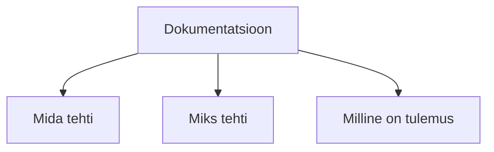

# Dokumentatsiooni juhend

Dokumentatsiooni eesmärk sõltub kontekstist, kuid põhimõte on sama: tehtud töö peab olema arusaadav, põhjendatud ja teistele kasutatav.

Õppetöös on dokumentatsioon tehniline tõendusmaterjal, mille abil näidatakse, mida tehti, miks seda tehti ja kas autor saab tehtud tööst aru.

Hea dokumentatsioon võimaldab:

- süsteemi üles ehitada ja taastada
- mõista, kuidas see töötab
- teostada haldust ja veaotsingut

{: .blue }
Dokumentatsioon ei kirjelda ainult tegevusi, vaid selgitab otsuseid ja tõendab tulemust, nii et teine inimene saab aru, mida tehti, miks seda tehti ja kuidas sama lahendus uuesti toimima panna.

Dokumentatsioon peab vastama kolmele küsimusele:

## Sisukord

- [Mida tehti](mida-tehti.md)
- [Miks tehti](miks-tehti.md)
- [Milline on tulemus](milline-on-tulemus.md)
- [Tõestus](toestus.md)
- [Vormistus ja kirjutamisviis](vormistus.md)
- [Tööriistad](tooriistad.md)
